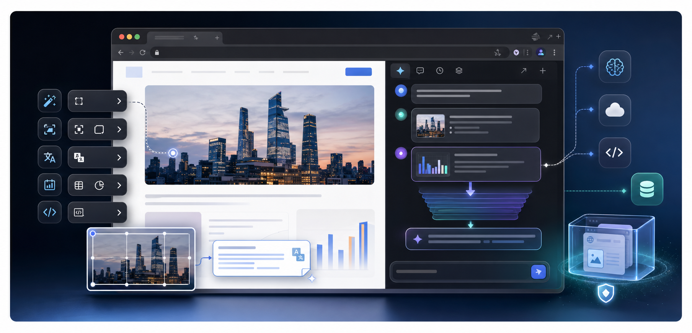

<div align="center">
  <a href="https://github.com/yeahhe365/Gemini-Nexus">
    
  </a>

# Gemini Nexus

### 🚀 赋予浏览器原生 AI 灵魂：集成 Gemini 与兼容 API 的全能助手

  <p>
    
    
    
  </p>

  <p>
    
    
    
  </p>

  

---

</div>

## 🌟 项目简介

**Gemini Nexus** 是一款集成 Google Gemini 与 OpenAI Compatible API 能力的 Chrome 扩展程序。它不仅仅是一个侧边栏插件，而是通过注入式的**悬浮工具栏**、强大的**图像 AI 处理**、基于 Chrome DevTools Protocol 的**浏览器控制工具**以及可选的**外部 MCP 工具**，将 AI 的触角伸向网页浏览的每一个交互细节。

---

## 🔧 能力概览

Gemini Nexus 当前围绕浏览器内 AI 工作流提供以下能力：

- **Gemini API** 与 **OpenAI Compatible API** 配置链路，支持自定义 `Base URL`、`API Key` 与 `Model IDs`。
- **Gemini API Google Search grounding** 支持，并在回复中展示联网来源。
- **侧边栏按标签页显示范围控制**，支持减少在不需要标签页中的干扰。
- **历史用户消息编辑**，支持从历史位置重新编辑并继续对话；该能力仅在 API 渠道启用。
- **上下文管理**，支持摘要压缩和最近 N 轮裁剪，降低长会话超过模型上下文的风险。
- 外部链接统一在浏览器新标签页打开，避免在侧边栏中加载外站失败。
- 扩展身份与本地升级链路会尽量保留设置，提升覆盖安装时的稳定性。

---

## ⚙️ 多驱动核心对比 (services/providers)

项目内置了三种驱动方案，通过代码逻辑动态适配不同的使用场景：

| 驱动方案              | 逻辑入口               | 支持模型         | 核心优势                                 | 使用前提                |
| :-------------------- | :--------------------- | :--------------- | :--------------------------------------- | :---------------------- |
| **Web Client**        | `web.js`               | Gemini 3 系列    | **免 API Key**，复用 Gemini 网页版会话   | 需保持 Google 账号登录  |
| **Official API**      | `official.js`          | Pro/Flash 预览版 | **极速响应**，原生支持 **Thinking** 模式 | 需 Google AI Studio Key |
| **OpenAI Compatible** | `openai_compatible.js` | GPT/Claude 等    | **高扩展性**，支持中转接口               | 需第三方服务密钥        |

---

## 🤖 浏览器控制 (Browser Control) 能力集

基于 `background/control/` 模块和 Chrome DevTools Protocol 实现，AI 可以通过本地工具循环执行复杂的 Agent 任务：

| 分类         | 核心指令                                                                           | 代码实现逻辑                                      |
| :----------- | :--------------------------------------------------------------------------------- | :------------------------------------------------ |
| **导航控制** | `navigate_page`, `new_page`                                                        | 调用 `chrome.tabs` 进行页面生命周期管理           |
| **页面交互** | `click`, `fill`, `fill_form`, `hover`, `drag_element`, `press_key`                 | 基于 **Accessibility Tree** 生成 UID 进行精准操控 |
| **数据观测** | `take_snapshot`, `take_screenshot`, `get_logs`                                     | 提取页面无障碍树、截图、控制台日志及浏览器问题    |
| **网络观测** | `get_network_activity`, `list_network_requests`, `get_network_request`             | 查看网络请求列表、状态、头信息及可用响应体        |
| **脚本执行** | `evaluate_script`, `run_javascript`, `run_script`                                  | 在网页 Context 中运行自定义 JavaScript            |
| **性能分析** | `performance_start_trace`, `performance_stop_trace`, `performance_analyze_insight` | 记录并分析页面性能指标                            |

---

## 外部 MCP 工具（远程服务器）

Gemini Nexus 可以选择连接到一个或多个外部 MCP 服务器（通过 **SSE**、**可流式传输的 HTTP** 或 **WebSocket**），并在现有的工具循环（Tool Loop）中执行其工具。

### 推荐方案：使用本地代理（支持 stdio 服务器）

由于 Chrome 扩展程序无法直接运行基于 stdio 的 MCP 服务器，推荐的设置方案是运行一个本地代理（例如 [MCP SuperAssistant](https://github.com/srbhptl39/MCP-SuperAssistant) Proxy）。在代理中配置您的 MCP 服务器（包括 stdio 服务器），然后将 Gemini Nexus 连接到该代理端点。

常见的代理端点如下：

- **SSE**: `http://127.0.0.1:3006/sse`
- **可流式传输的 HTTP**: `http://127.0.0.1:3006/mcp`
- **WebSocket**: `ws://127.0.0.1:3006/mcp`

### 设置步骤

1.  启动您的 MCP 代理并在其中配置好 MCP 服务器。

2.  在 **设置 (Settings) → 连接 (Connection) → 外部 MCP 工具 (External MCP Tools)** 中：
    - 启用“外部 MCP 工具” (Enable External MCP Tools)。
    - 新增或选择服务器条目；**活动服务器** (Active Server) 表示当前正在编辑的条目，对话时会使用所有已启用的服务器。
    - 选择传输协议并设置服务器 URL（SSE / 可流式传输的 HTTP / WebSocket）。
    - 点击**测试连接** (Test Connection) 和**刷新工具** (Refresh Tools)。

3.  可选（当工具较多时推荐）：将**公开工具** (Expose Tools) 设置为**仅限选定工具** (Selected tools only)，然后仅启用您希望模型查看/使用的工具。

4.  开始正常对话；当模型需要使用工具时，它会输出一个如下所示的 JSON 工具块。多服务器模式下，模型可能会使用 `serverId__toolName` 形式的唯一工具名来路由到具体服务器：

    ```json
    { "tool": "工具名称", "args": { "键": "值" } }
    ```

---

## ✨ 核心功能亮点

- **💬 智能侧边栏**：基于 `sidePanel` API，提供毫秒级唤起的对话空间，支持全文搜索历史记录。
- **🪄 划词工具栏**：注入 Content Script，选中文字即刻进行**翻译、总结、解释、语法修正**，支持一键回填表单。
- **🖼️ 图像 AI 处理**：
    - **OCR & 截图翻译**：集成 Canvas 裁剪技术，框选图片区域即刻提取文字并翻译。
    - **浮窗探测**：自动识别网页图片并生成悬浮 AI 分析按钮。
    - **水印消除**：内置 `watermark_remover.js` 算法，显著提升生成图像的可视化质量。
- **🛡️ 安全渲染**：所有 Markdown、LaTeX 公式及代码块均在 `sandbox` 隔离环境中渲染，确保主页面安全。

---

## 🚀 快速开始

### 仓库结构

本仓库根目录就是可运行的 Chrome 扩展项目根目录。`package.json`、`manifest.json`、Vite 配置、源码、测试和打包脚本都位于根目录。跨运行域共享的工具代码位于 `shared/`，并按能力分组到 `shared/config/`、`shared/dom/`、`shared/media/`、`shared/messaging/`、`shared/text/` 和 `shared/utils/`；顶层 `shared/*.js` 仅作为旧引用兼容入口。

### 安装步骤

1.  从 [Releases](https://github.com/yeahhe365/Gemini-Nexus/releases) 下载最新 ZIP 包并解压。
2.  Chrome 访问 `chrome://extensions/`，右上角开启 **“开发者模式”**。
3.  点击 **“加载已解压的扩展程序”**，选择解压后的文件夹即可。

### 从源码构建/打包

```bash
npm install
npm run package:extension
```

打包完成后，Chrome 的 **“加载已解压的扩展程序”** 应选择 `artifacts/chrome-extension`。开发调试时也可以直接加载仓库根目录；`npm run build` 生成的 `dist/` 只是 Vite UI 构建产物，不是完整扩展目录。发布包会把多个 content scripts 按 `manifest.json` 中的顺序合并为单个 `content/index.js`，并重写包内 manifest，避免发布产物依赖一长串手工脚本顺序。

### 技术栈

- **构建工具**：Vite + TypeScript
- **架构协议**：Chrome MV3 + Chrome DevTools Protocol + 本地/外部 MCP 工具调用
- **核心库**：Marked.js, KaTeX, Highlight.js, Fuse.js

## 📄 许可证

本项目基于 **MIT License** 开源。

## 致谢

本项目已在 [LINUX DO 社区](https://linux.do) 发布，感谢社区的支持与反馈。
